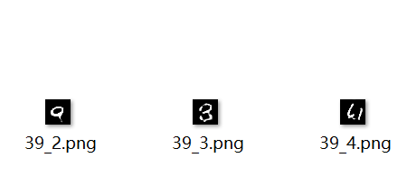
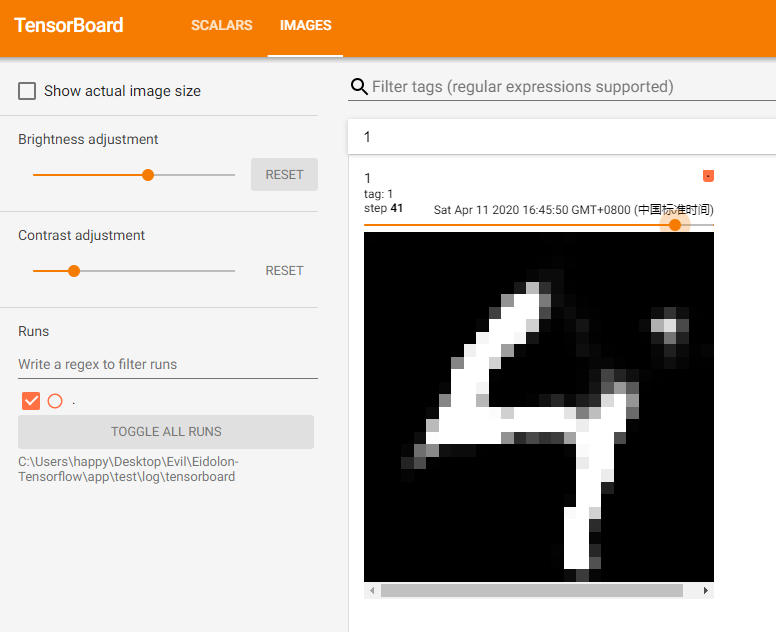
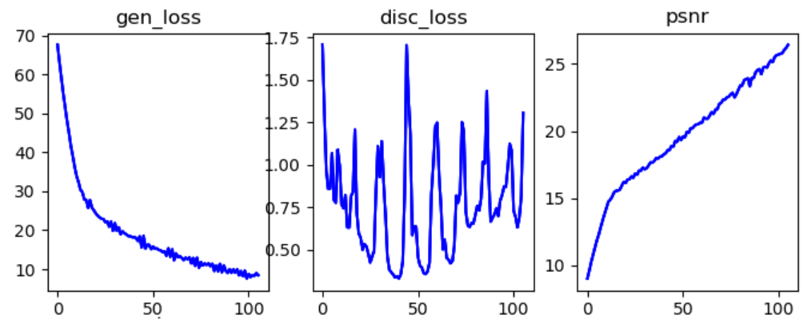
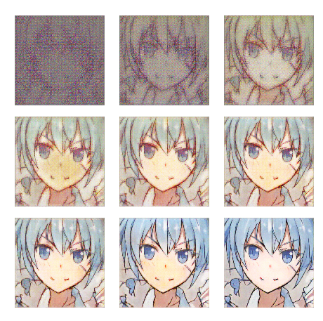

*<font style="color:lightgray">
我不懂深度学习，但我懂如何构建软件，我看得到其中的痛点。写深度学习也有两年了，也有很多繁琐的地方，将其中通用的代码组成了本框架——eidolon。
eidolon本意守护精灵的意思，我也希望一直守护这你。
</font>*

# Eidolon-Tensorflow（New version coming Soon）
 A framework to manage the training lifecycle of your tensorflow apps.

# Eidolon 是什么?
`Eidolon` 是用于你在使用 `Tensorflow` 训练模型时，管理生命周期的框架。
`Tensorflow` 以及高层的 `Keras` 接口已经大大改善构建模型结构与优化损失函数的过程。但在训练整个模型时，整个生命周期还需要自己管理，包括：
* 准备阶段
    > 加载数据集，创建与管理模型实例，设置每一个模型对应的优化器等。
* 训练阶段
    > 循环传入批数据，计算梯度与更新参数，保存每一轮的检查点等。
* 测试阶段
    > 保存每一轮的损失值，保存测试结果，可视化数据等。

此外，在每次创建一个训练任务时，均需要重新构建上述过程。然而上述过程与设计模型本真无关。
`Eidolon`允许你在编写少量代码甚至是无代码的情况下，自动完成上述任务，你可以更专注于设计模型本身。


# 快速开始
*本项目目前尚未构建完成，现阶段创建项目按如下步骤执行*
1. 下载并解压本项目。
2. 进入项目根目录并运行:  
   `python create.py -n app_name`  
   其中`app_name`为你所希望创建的工程名称，更多用法请输入参数  `-h` 或 `--help`。
3. 此时，需要训练的工程已经创建于 `./app/app_name`目录下。
4. 初始化目录中包含几个基本文件与脚本，主要文件有：`config.json`为配置文件；`train.   bat`为项目运行脚本入口。在不同系统中，其创建的脚本略有不同，在Linux系统中，还包括`train-backend.sh`，该脚本用于后台运行训练程序。
5. 工程创建完毕，运行脚本`train.bat`即可开始训练。定制化配置不同的训练流程，请修改`config.json`中的内容。下一节入门教程将给出MNIST识别与生成的两个例子。


# 入门教程
接下来将介绍一些易于上手本框架的教程，包括手写体识别与手写体生成。
默认读者已经对如何使用 `tensorflow` 构建深度学习训练流程有了一定的了解。
## 教程一：构建手写体识别训练
本教程将介绍使用 `eidolon` 训练手写体识别。并自动进行生命周期管理，损失函数保存，模型检查点保存等内容。并且在最后介绍接入`tensorboard`。
### **步骤1：创建工程**
按照快速开始中的方法构建工程，本教程取名为mnist。
### **步骤2：创建模型**
创建 `mnist.py`，可放置于任意位置，并在其中构建模型，本教程将该文件放置于`./eidolon/model/`下。使用 `Tensorflow.Keras API` 创建模型，本教程只是用最简单的模型，代码如下：

```python
def make_DNN_model():

    #定义各层
    inputs=tf.keras.layers.Input(shape=(28,28))

    flatten=tf.keras.layers.Flatten()

    layer1=tf.keras.layers.Dense(128,activation="relu")

    dropout=tf.keras.layers.Dropout(0.2)

    layer2=tf.keras.layers.Dense(10,activation="softmax")

    #连接各层
    outputs=flatten(inputs)
    outputs=layer1(outputs)
    outputs=dropout(outputs)
    outputs=layer2(outputs)

    return tf.keras.Model(inputs=inputs,outputs=outputs)
```

### **步骤3：创建训练容器（核心）**
创建 `example_container.py`，可放置于任意位置，本教程将该文件放置于`./eidolon/`目录下。
首先引入tensorflow包与eidolon核心包。

```python
import tensorflow as tf
from eidolon import train
```
其次创建类，并继承`eidolon.train.Container`，所有容器均需继承自该类或该类的子类，我们需要做的是覆盖以下三个方法。代码结构如下。
```python
class MnistGANContainer(train.Container):
    def on_prepare(self):
        #准备你自己的内容和

        # 调用父类
        super(MnistGANContainer, self).on_prepare()

    def compute_loss_function(self, each_batch, extra_batch_data):

        # 定义损失函数计算
        return {},{}

    def compute_test_metrics_function(self, each_batch, extra_batch_data):
        #定义评价指标

        return {}
```
重写准备阶段的内容，包括加载数据集，创建模型，与指定优化器。
其代码如下：
```python
def on_prepare(self):

        # 载入数据集
        data = tf.keras.datasets.mnist.load_data()
        (train_images, train_labels), (test_images, test_labels)=data
        train_images = train_images.reshape(
            train_images.shape[0], 28, 28, 1).astype('float32')
        train_images = (train_images - 127.5) / 127.5  # 将图片标准化到 [-1, 1] 区间内
        test_images = (test_images - 127.5) / 127.5
        train_dataset = tf.data.Dataset.from_tensor_slices(
            (train_images, train_labels)).shuffle(BUFFER_SIZE).batch(BATCH_SIZE)
        test_dataset = tf.data.Dataset.from_tensor_slices(
            (test_images, test_labels)).shuffle(BUFFER_SIZE).batch(BATCH_SIZE)
        # 注册数据集
        self.register_dataset(train_dataset, test_dataset)
        # print(train_datase)

        # 创建模型
        self.model = mnist.make_DNN_model()
        # 设置优化器
        optimizer = tf.keras.optimizers.Adam(1e-4)
        # 注册模型与优化器
        self.register_model_and_optimizer(
            optimizer, {"model": self.model}, "optimizer")

        # 创建损失函数计算器
        self.loss_function = tf.keras.losses.SparseCategoricalCrossentropy()

        # 注册需要记录的损失名称
        self.register_display_metrics(["train loss"])

        # 调用父类(推荐)
        super(MnistClassifierContainer, self).on_prepare()
```

定义损失函数阶段，其中该函数返回两个map，第一个为待优化的map，第二个为需要保存的损失数值。在该教程中，两者一致，但是在更多的情况下，损失函数由多项组成，你可能想分别查看每一项损失的收敛情况。
```python
def compute_loss_function(self, each_batch, extra_batch_data):

        # 分离输入与标签
        inputs, labels = each_batch

        outputs = self.model(inputs, training=True)

        loss = self.loss_function(labels, outputs)

        # 返回结果集
        return {"optimizer": loss}, {"train loss": loss}
```
定义评价指标，本教程仅仅随意实现了该评价方式，返回准确率，你也可以使用tf.keras内置的方式或者其他实现方式。该函数返回一个结果map，包含名称与结果。
```python
def compute_test_metrics_function(self, each_batch, extra_batch_data):

        #
        test_images, test_labels = each_batch
        predictions = self.model(test_images)

        search = [[1, 0, 0, 0, 0, 0, 0, 0, 0, 0],
                  [0, 1, 0, 0, 0, 0, 0, 0, 0, 0],
                  [0, 0, 1, 0, 0, 0, 0, 0, 0, 0],
                  [0, 0, 0, 1, 0, 0, 0, 0, 0, 0],
                  [0, 0, 0, 0, 1, 0, 0, 0, 0, 0],
                  [0, 0, 0, 0, 0, 1, 0, 0, 0, 0],
                  [0, 0, 0, 0, 0, 0, 1, 0, 0, 0],
                  [0, 0, 0, 0, 0, 0, 0, 1, 0, 0],
                  [0, 0, 0, 0, 0, 0, 0, 0, 1, 0],
                  [0, 0, 0, 0, 0, 0, 0, 0, 0, 1]]

        test_labels=np.array(test_labels)
        labels = np.zeros([len(test_labels), 10])
        for i in range(len(test_labels)):
            labels[i]=search[test_labels[i]]


        predictions = np.array(predictions)
        predictions[predictions > 0.5] = 1
        predictions[predictions <= 0.5] = 0

        error = tf.reduce_mean(tf.abs(predictions-labels)/2)

        return {"accuracy": 1-error}
```
### **步骤4：运行**
进入刚才创建好的目录`./app/mnist`。
打开配置文件 `config.json`
修改启动容器为 `eidolon.example_container.MnistClassifierContainer`。
该部分的`JSON`文件如下，同样你也可以修改训练轮数，保存周期等其他参数。
```json
"container": {
      "value": "eidolon.example_container.MnistClassifierContainer",
      "desc": "定义训练使用的容器。容器用于管理整个训练的生命周期。"
    },
    "epoch": {
      "value": 2000,
      "desc": "训练轮数。默认为2000轮。"
    },
    "save_period": {
      "value": 1,
      "desc": "保存周期。每过一个保存周期，将会保存训练的检查点以及记录训练日志。"
    },
```
运行`train.bat`开始训练。该过程为自动将每一个训练周期的模型检查点保存至`./app/mnist/training_checkpoints/`目录下，并且将 `.h5`模型文件保存在 `./app/mnist/model` 目录下。所有日志与训练解损失保存在 `log` 目录下。
经过几轮训练，损失函数大大下降。可以运行`./paint_loss.bat`使用内置引擎（还在构建，功能有限）查看可视化损失曲线，如下图。

<div>

</div>

或者读取 `./app/mnist/log/train_log.txt` 查看数值。前三轮损失函数如下：
```python
epoch=1,timestamp=Apr-11-2020-14:44:46,train loss=1.1976970434188843,accuracy=0.9850830078124998
epoch=2,timestamp=Apr-11-2020-14:44:48,train loss=0.5482775568962097,accuracy=0.9898486328124999
epoch=3,timestamp=Apr-11-2020-14:44:49,train loss=0.4318382441997528,accuracy=0.9912109375
```
### **步骤5：接入Tensorboard**
上述均使用`eidolon`内置的日志与可视化引擎来展示训练数据，可视化层尚在构建中，若想要实现更多功能，或者你可能习惯于使用`Tensorboard`，同样很简单。无需任何一行代码，只需要在配置文件中启用`Tensorboard`即可。配置文件启用该功能的位置如下：
```json
"tensorboard_enable": {
      "value": true,
      "desc": "启用tensorboard记录日志。可以使用tensorboard在页面查看训练情况。"
    },
```
其`Tensorboard`日志记录位置为`./app/log/tensorboard`。若启用该功能，则会在日志目录中看到这个子目录。随后，使用官方一致的方法打开`Tensorboard`，命令行输入如下命令即可：
```
tensorboard --logdir=your_app_path/log/tensorboard
```
即可看到上述一致的效果。
<div style="text-align:center">

</div>

### **注意事项与强调**
**准备阶段需要在重写该方法时需要注意一下几点：**
* **注册数据集。**
    在载入数据集之后，需要调用以下方法对数据集进行注册。该容器在训练时会自动喂入数据集进行训练。
    ```python
    self.register_dataset(train_dataset, test_dataset)
    ```
    训练集必须进行注册，若无需测试集则只传入训练集，如下：
    ```python
    self.register_dataset(train_dataset)
    ```
* **指定优化器与模型的关系。**
    在创建模型与优化器之后，需要指定每个模型对应的优化器。其中模型需要使用key-value的键值对，其中key是模型的名称（自己命名），value为模型实例。如:
    ```python
    model_map = {"model": model}
    ```
    使用如下函数注册对应关系，`optimizer_name` 需要自己命名。若存在多个优化函数（如生成对抗网络），则调用多次。
    ```python
    self.register_model_and_optimizer(
            optimizer, model_map, optimizer_name)
    ```
* **注册需要记录的损失函数名字。**
    把需要保存的损失值名称使用如下函数进行注册，名称自行命名，该过程很重要。
    ```python
    self.register_display_metrics(["train loss"])
    ```
* **调用父类`on_prepare(self)`方法。**
    父类方法包含自动载入与保存数据集，因此如果希望实现该功能，则需要调用该方法。警告：仅允许在结尾调用该方法，否则可能会报错。

**定义损失函数阶段注意事项如下：**
* **返回值：**
    该函数需要返回两个 `key-value` 字典。第一个字典为需要优化的损失函数表。`key` 为优化器名称，需要与用 `register_model_and_optimizer()` 注册优化器时所用的名字一致，`value` 为损失函数。第二个字典为需要保存与展示的损失函数表。`key` 为需要保存的损失值名称，其名称需要与`register_display_metrics()` 注册的名称一致， `value` 为损失函数。有时一个损失函数的多项均想要保存，则均需要在第二项指定。

**定义评价指标注意事项如下：**
* **返回值：**
    该函数返回一个 `key-value` 字典。`key` 为展示的评价指标名称，`value` 为评价指标值。


## 教程二：构建手写体生成对抗网络训练
本教程将介绍使用 `eidolon` 训练手写体生成对抗网络。并自动进行生命周期管理，损失函数保存，模型检查点保存，生成图像可视化等内容。

### 步骤1：创建工程、创建模型、与创建训练容器。
该过程与教程1一致，可直接参考手写体识别教程。
该生成网络与判决网络使用代码如下：
```python
def make_generator_model():
    model = tf.keras.Sequential()
    model.add(tf.keras.layers.Dense(7*7*256, use_bias=False, input_shape=(100,)))
    model.add(tf.keras.layers.BatchNormalization())
    model.add(tf.keras.layers.LeakyReLU())

    model.add(tf.keras.layers.Reshape((7, 7, 256)))
    # assert model.output_shape == (None, 7, 7, 256) # 注意：batch size 没有限制

    model.add(tf.keras.layers.Conv2DTranspose(128, (5, 5), strides=(1, 1), padding='same', use_bias=False))
    # assert model.output_shape == (None, 7, 7, 128)
    model.add(tf.keras.layers.BatchNormalization())
    model.add(tf.keras.layers.LeakyReLU())

    model.add(tf.keras.layers.Conv2DTranspose(64, (5, 5), strides=(2, 2), padding='same', use_bias=False))
    # assert model.output_shape == (None, 14, 14, 64)
    model.add(tf.keras.layers.BatchNormalization())
    model.add(tf.keras.layers.LeakyReLU())

    model.add(tf.keras.layers.Conv2DTranspose(1, (5, 5), strides=(2, 2), padding='same', use_bias=False, activation='tanh'))

    return model

def make_discriminator_model():
    model = tf.keras.Sequential()
    model.add(tf.keras.layers.Conv2D(64, (5, 5), strides=(2, 2), padding='same',
                                     input_shape=[28, 28, 1]))
    model.add(tf.keras.layers.LeakyReLU())
    model.add(tf.keras.layers.Dropout(0.3))

    model.add(tf.keras.layers.Conv2D(128, (5, 5), strides=(2, 2), padding='same'))
    model.add(tf.keras.layers.LeakyReLU())
    model.add(tf.keras.layers.Dropout(0.3))

    model.add(tf.keras.layers.Flatten())
    model.add(tf.keras.layers.Dense(1))

    return model
```
### **步骤2：创建训练容器（核心）**
重写准备阶段的内容，包括加载数据集，创建模型，与指定优化器。
容器类起名为 `MnistGANContainer`，同样继承`eidolon.train.Container`
其代码如下：
```python
def on_prepare(self):

        # 载入数据集
        (train_images, _), (_, _) = tf.keras.datasets.mnist.load_data()
        train_images = train_images.reshape(train_images.shape[0], 28, 28, 1).astype('float32')
        train_images = (train_images - 127.5) / 127.5  # 将图片标准化到 [-1, 1] 区间内
        train_dataset = tf.data.Dataset.from_tensor_slices(train_images).shuffle(BUFFER_SIZE).batch(BATCH_SIZE)
        # 注册数据集
        self.register_dataset(train_dataset)

        # 创建模型
        self.generator = mnist_gan.make_generator_model()
        self.discriminator = mnist_gan.make_discriminator_model()

        # 创建优化器
        generator_optimizer = tf.keras.optimizers.Adam(1e-4)
        discriminator_optimizer = tf.keras.optimizers.Adam(1e-4)

        # 注册模型与优化器
        self.register_model_and_optimizer(generator_optimizer, {"generator": self.generator},"generator_opt")
        self.register_model_and_optimizer(discriminator_optimizer, {"discriminator": self.discriminator}, "discriminator_opt")

        self.register_display_metrics(["generator loss","discriminator loss"])
        # 调用父类
        super(MnistGANContainer, self).on_prepare()
```


定义损失函数如下
```python
def compute_loss_function(self, each_batch, extra_batch_data):

        # 随机生成输入
        noise = tf.random.normal([BATCH_SIZE, NOISE_DIM])
        # 生成输出
        generated_images = self.generator(noise, training=True)

        # 输入真实图像后的输出
        real_output = self.discriminator(each_batch, training=True)
        # 当输入错误图像后的输出
        fake_output = self.discriminator(generated_images, training=True)

        # 计算判别损失
        gen_loss, disc_loss = loss_util.gan_loss(real_output, fake_output)

        # 返回结构集
        return {"generator_opt": gen_loss, "discriminator_opt": disc_loss}, {"generator loss": gen_loss, "discriminator loss": disc_loss}
```

定义可视化函数，该过程需要注意，教程1中没有出现。所有的可视化图像会保存在`./log/result_image`中。该函数返回两个列表，第一个列表为图像列表，每个图像为4维张量，第二个列表为图像标题名称。
```python
def on_test_visual(self):
        noise = tf.random.normal([4, NOISE_DIM])

        predictions = self.generator(noise, training=False)

        # 排成列表
        image_list = [predictions[0:1], predictions[1:2],
                      predictions[2:3], predictions[3:4]]
        title_list = ["1", "2", "3", "4"]
        return image_list, title_list
```
### **步骤3：运行**
进入刚才创建好的目录，比如 `./app/mnist_gan`。
打开配置文件 `config.json`。如果容器文件 `example_container.py` 保存`./eidolon`目录中，则修改启动容器为 `eidolon.example_container.MnistGANContainer`。
该部分的`JSON`文件如下，同样你也可以修改训练轮数，保存周期等其他参数。
```json
"container": {
      "value": "eidolon.example_container.MnistGANContainer",
      "desc": "定义训练使用的容器。容器用于管理整个训练的生命周期。"
    },
    "epoch": {
      "value": 2000,
      "desc": "训练轮数。默认为2000轮。"
    },
    "save_period": {
      "value": 1,
      "desc": "保存周期。每过一个保存周期，将会保存训练的检查点以及记录训练日志。"
    },
```
运行`train.bat`开始训练。该过程为自动将每一个训练周期的模型检查点保存至 `./app/mnist/training_checkpoints/` 目录下，将 `.h5` 模型文件保存在 `./app/mnist/model` 目录下，损失曲线保存在 `./app/mnist_gan/log/train_log.txt` 中，并将每一轮生成的图像保存至 `./app/mnist_gan/log/result_image` 中，如图，命名格式为 `{训练轮数}_{当前轮的某一张}`。



同样可以启用`Tensorboard`查看每一轮训练效果。




## 教程三：无代码训练图像生成网络
本教程将使用 `eidolon` 训练图像生成网络，而无需编写代码。其效果如下图所示，左边为输入铅笔素描，右边为输出彩色图像。该数据集需要自行去网站下载：https://www.gwern.net/Danbooru2019 。


### **步骤1：创建项目**
进入项目根目录并运行:  `python create.py -n animate-face`，其中`animate-face`为你所希望创建的工程名称，还可以取别的名字。创建完成后进入工程目录 `./app/animate-face`

### **步骤2：自定义配置（核心）**
打开配置文件 `config.json`，所有配置均在该文件中定义。
1. 修改训练图像属性，包括图像大小与图像格式，下例展示输入128*128，图像格式为png的配置。
```json
"image_size": {
    "value": [
    128,
    128,
    3
    ],
    "desc": "输入图像的尺寸，依次为：宽、高、通道。数据集中所有图像会裁剪成该尺寸。（注意：多余通道会被直接忽略）。"
},
"image_type": {
    "value": "png",
    "desc": "图像格式，可选：jpg, png, bmp。"
},
```

2. 数据增强
下例展示了每次输入数据以0.5的概率随机翻转，并且随机裁剪尺寸为30px的内容。
```json
"data_flip": {
    "value": 0.5,
    "desc": "图像反转概率，在输入图像的时候存在一定的概率翻转图像已达到数据增强的效果。可输入（0-1）的小数。默认为0（不翻转）。"
},
"crop_size": {
    "value": [
    30,
    30
    ],
    "desc": "图像裁剪，在输入图像的时候随机裁剪一定的尺寸已达到数据增强。默认情况下关闭。"
}
```
3. 设置运行容器与数据集位置
设置容器为 `eidolon.pixel_container.PixelContainer`,该容器为 `eidolon` 内部自带容器。
下例展示了设置数据集路径为 `../../data/animate-face`。
训练轮数与保存周期与其他设置可按照实际需求自定义设置。
```json
"container": {
    "value": "eidolon.pixel_container.PixelContainer",
    "desc": "定义训练使用的容器。容器用于管理整个训练的生命周期。"
},
"epoch": {
    "value": 2000,
    "desc": "训练轮数。默认为2000轮。"
},
"save_period": {
    "value": 1,
    "desc": "保存周期。每过一个保存周期，将会保存训练的检查点以及记录训练日志。"
},
"data_dir": {
    "value": "../../data/animate-face",
    "desc": "训练数据集所在路径，相对位置为当前应用app所在位置。"
},
```
4. 设置生成网络与判决网络
下例给出设置生成网络为 `U-Net` 网络，判决网络为 `CGAN`。
```json
"generator": {
    "value": "unet",
    "desc": "训练使用的生成器结构，默认使用Unet。包含选择：unet, resnet16。"
},
"discriminator": {
    "value": "cgan",
    "desc": "训练使用的生成器结构，默认不使用判决器。包含选择：no, gan, cgan。"
},
"high_performance": {
    "value": false,
    "desc": "如果在低配GPU中(<4G)，可能发生网络结构过于复杂而显存不足的情况。禁用该选项时，会把UNet中的编码器最后一层与解码器第一层去除。"
},
```
### **步骤3：运行**
在该工程目录中，运行 `train.bat` 文件。所有可视化结果位于 `./log/result_image/` 目录下，损失函数与评价指标位 `./log/train_log.txt` 文件中。
经过多轮迭代，其损失函数与测试 `PSNR` 结果如下:



多轮迭代的可视化结果如下所示：



同样的，更换数据集，可以达到不同任务的效果。

    


# APIs(使用说明尚未整理)
## `loader.read_image`
### 签名
    read_image(
        image_file, 
        image_type
    )

### 例子
    # 该例子用于读取一张名为color.jpg的图片。
    # 图片类型是jpg。
    read_image("color.jpg","jpg")

### 参数
* `image_file`: 字符串，待读取的图片名。
* `image_type`: 字符串，图片类型。目前支持：png, jpg, bmp.

### 返回值
* 图像3-D张量 `[img_height, img_width, channel]`               


# Inner Function
## lifecycle
整个训练的生命周期分为三部分组成：准备阶段，训练阶段，结束阶段，分别对应以下三个函数：
* on_prepare( ) 
    > 准备阶段，该方法在最初调用。用于完成所有准备工作，例如：载入数据集，创建模型，指定优化器等。
* on_train( )
    > 正式训练阶段，在完成on_prepare( )后调用该方法。持续对模型进行迭代。 
* on_finish( )
    > 训练结束后调用，在结束on_train( )方法后调用。 用于做一些最后的整理工作，例如测试最终模型效果，保存最终模型等。


