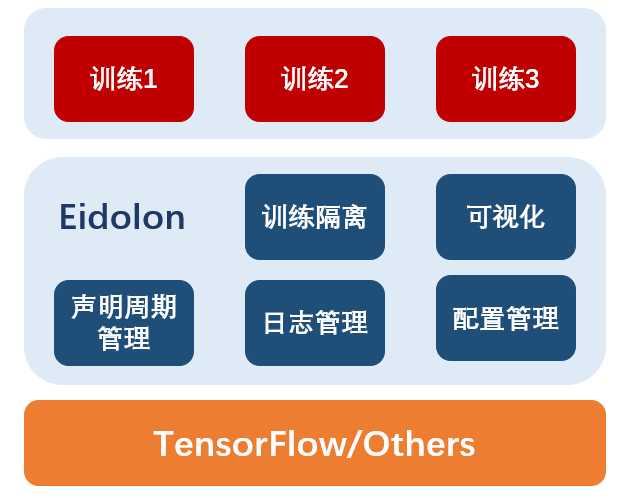
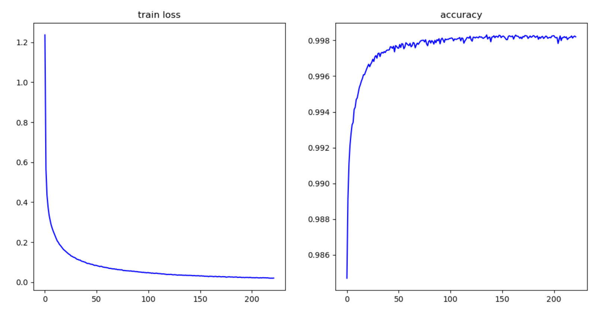
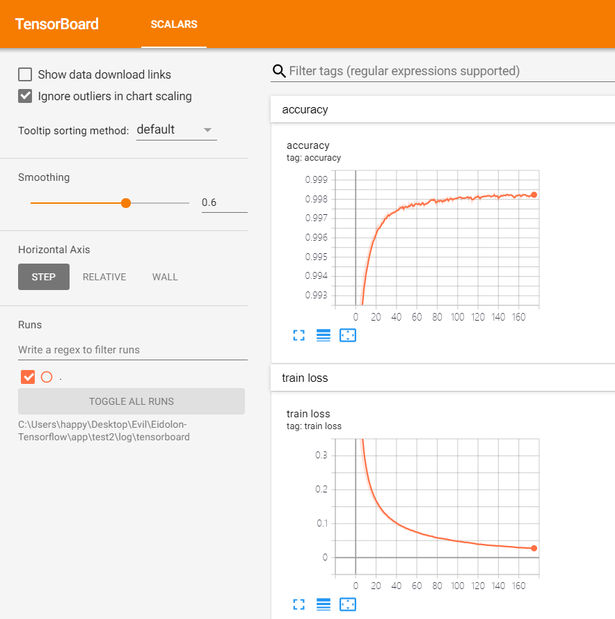

# Eidolon-Tensorflow（New version coming Soon）
 A framework to manage the training lifecycle of tensorflow apps.

# What's Eidolon?




# 快速开始
*本项目目前尚未构建完成，现阶段创建项目按如下步骤执行*
1. 下载并解压本项目。
2. 进入项目根目录并运行:  
   `python create.py -n app_name`  
   其中`app_name`为你所希望创建的工程名称，更多用法请输入参数  `-h` 或 `--help`。
3. 此时，需要训练的工程已经创建于 `./app/app_name`目录下。
4. 初始化目录中包含几个基本文件与脚本，主要文件有：`config.json`为配置文件；`train.   bat`为项目运行脚本入口。在不同系统中，其创建的脚本略有不同，在Linux系统中，还包括`train-backend.sh`，该脚本用于后台运行训练程序。
5. 工程创建完毕，运行脚本`train.bat`即可开始训练。定制化配置不同的训练流程，请修改`config.json`中的内容。下一节入门教程将给出MNIST识别与生成的两个例子。


# 入门教程
## 教程一：构建手写体识别训练
本教程将介绍使用该框架训练手写体识别。并自动进行生命周期管理，损失函数保存，模型检查点保存等内容。并且在最后介绍接入`tensorboard`。
### **步骤1：创建工程**
按照快速开始中的方法构建工程，本教程取名为mnist。
### **步骤2：创建模型**
创建 `mnist.py`，可放置于任意位置，并在其中构建模型，本教程推荐将该文件放置于`./eidolon/model/`下。使用 `Tensorflow.Keras API` 创建模型，本教程只是用最简单的模型，代码如下：

```python
def make_DNN_model():

    #定义各层
    inputs=tf.keras.layers.Input(shape=(28,28))

    flatten=tf.keras.layers.Flatten()

    layer1=tf.keras.layers.Dense(128,activation="relu")

    dropout=tf.keras.layers.Dropout(0.2)

    layer2=tf.keras.layers.Dense(10,activation="softmax")

    #连接各层
    outputs=flatten(inputs)
    outputs=layer1(outputs)
    outputs=dropout(outputs)
    outputs=layer2(outputs)

    return tf.keras.Model(inputs=inputs,outputs=outputs)
```

### **步骤3：创建训练容器（核心）**
创建 `example_container.py`，可放置于任意位置，本教程将该文件放置于`./eidolon/`目录下。
首先引入tensorflow包与eidolon核心包。

```python
import tensorflow as tf
from eidolon import train
```
其次创建类，并继承`train.Container`，代码结构如下。
```python
class MnistGANContainer(train.Container):
    def on_prepare(self):
        #准备你自己的内容和

        # 调用父类
        super(MnistGANContainer, self).on_prepare()

    def compute_loss_function(self, each_batch, extra_batch_data):

        # 定义损失函数计算
        return {},{}

    def compute_test_metrics_function(self, each_batch, extra_batch_data):
        #定义评价指标

        return {}
```
执行准备阶段的内容，包括加载数据集，创建模型，与指定优化器。
其代码如下：
```python
def on_prepare(self):

        # 载入数据集
        data = tf.keras.datasets.mnist.load_data()
        (train_images, train_labels), (test_images, test_labels)=data
        train_images = train_images.reshape(
            train_images.shape[0], 28, 28, 1).astype('float32')
        train_images = (train_images - 127.5) / 127.5  # 将图片标准化到 [-1, 1] 区间内
        test_images = (test_images - 127.5) / 127.5
        train_dataset = tf.data.Dataset.from_tensor_slices(
            (train_images, train_labels)).shuffle(BUFFER_SIZE).batch(BATCH_SIZE)
        test_dataset = tf.data.Dataset.from_tensor_slices(
            (test_images, test_labels)).shuffle(BUFFER_SIZE).batch(BATCH_SIZE)
        # 注册数据集
        self.register_dataset(train_dataset, test_dataset)
        # print(train_datase)

        # 创建模型
        self.model = mnist.make_DNN_model()
        # 设置优化器
        optimizer = tf.keras.optimizers.Adam(1e-4)
        # 注册模型与优化器
        self.register_model_and_optimizer(
            optimizer, {"model": self.model}, "optimizer")

        # 创建损失函数计算器
        self.loss_function = tf.keras.losses.SparseCategoricalCrossentropy()

        # 注册需要记录的损失名称
        self.register_display_metrics(["train loss"])

        # 调用父类(推荐)
        super(MnistClassifierContainer, self).on_prepare()
```

定义损失函数阶段，其中该函数返回两个map，第一个为待优化的map，第二个为需要保存的损失数值。在该教程中，两者一致，但是在更多的情况下，损失函数由多项组成，你可能想分别查看每一项损失的收敛情况。
```python
def compute_loss_function(self, each_batch, extra_batch_data):

        # 分离输入与标签
        inputs, labels = each_batch

        outputs = self.model(inputs, training=True)

        loss = self.loss_function(labels, outputs)

        # 返回结果集
        return {"optimizer": loss}, {"train loss": loss}
```
定义评价指标，本教程仅仅随意实现了该评价方式，返回准确率，你也可以使用tf.keras内置的方式或者其他实现方式。该函数返回一个结果map，包含名称与结果。
```python
def compute_test_metrics_function(self, each_batch, extra_batch_data):

        #
        test_images, test_labels = each_batch
        predictions = self.model(test_images)

        search = [[1, 0, 0, 0, 0, 0, 0, 0, 0, 0],
                  [0, 1, 0, 0, 0, 0, 0, 0, 0, 0],
                  [0, 0, 1, 0, 0, 0, 0, 0, 0, 0],
                  [0, 0, 0, 1, 0, 0, 0, 0, 0, 0],
                  [0, 0, 0, 0, 1, 0, 0, 0, 0, 0],
                  [0, 0, 0, 0, 0, 1, 0, 0, 0, 0],
                  [0, 0, 0, 0, 0, 0, 1, 0, 0, 0],
                  [0, 0, 0, 0, 0, 0, 0, 1, 0, 0],
                  [0, 0, 0, 0, 0, 0, 0, 0, 1, 0],
                  [0, 0, 0, 0, 0, 0, 0, 0, 0, 1]]

        test_labels=np.array(test_labels)
        labels = np.zeros([len(test_labels), 10])
        for i in range(len(test_labels)):
            labels[i]=search[test_labels[i]]


        predictions = np.array(predictions)
        predictions[predictions > 0.5] = 1
        predictions[predictions <= 0.5] = 0

        error = tf.reduce_mean(tf.abs(predictions-labels)/2)

        return {"accuracy": 1-error}
```
### **步骤4：运行**
进入刚才创建好的目录`./app/mnist`。
打开配置文件 `config.json`
修改启动容器为 `eidolon.example_container.MnistClassifierContainer`。
该部分的`JSON`文件如下，同样你也可以修训练轮数，保存周期等其他参数。
```json
"container": {
      "value": "eidolon.example_container.MnistClassifierContainer",
      "desc": "定义训练使用的容器。容器用于管理整个训练的生命周期。"
    },
    "epoch": {
      "value": 2000,
      "desc": "训练轮数。默认为2000轮。"
    },
    "save_period": {
      "value": 1,
      "desc": "保存周期。每过一个保存周期，将会保存训练的检查点以及记录训练日志。"
    },
```
运行`train.bat`开始训练。该过程为自动将每一个训练周期的模型检查点保存至`./app/mnist/training_checkpoints/`目录下，并且将 `.h5`模型文件保存在 `model` 目录下。所有日志与训练解损失保存在 `log` 目录下。
经过几轮训练，损失函数大大下降。可以运行`./paint_loss.bat`使用内置引擎（还在构建，功能有限）查看可视化损失曲线，如下图。

<div style="text-align:center">

</div>

或者读取 `./app/mnist/log/train_log.txt` 查看数值。前三轮损失函数如下：
```python
epoch=1,timestamp=Apr-11-2020-14:44:46,train loss=1.1976970434188843,accuracy=0.9850830078124998
epoch=2,timestamp=Apr-11-2020-14:44:48,train loss=0.5482775568962097,accuracy=0.9898486328124999
epoch=3,timestamp=Apr-11-2020-14:44:49,train loss=0.4318382441997528,accuracy=0.9912109375
```
### **步骤5：接入Tensorboard**
上述均使用`eidolon`内置的日志与可视化引擎来展示训练数据，可视化层尚在构建中，若想要实现更多功能，或者你可能习惯于使用`Tensorboard`，同样很简单。无需任何一行代码，只需要在配置文件中启用`Tensorboard`即可。配置文件启用该功能的位置如下：
```json
"tensorboard_enable": {
      "value": true,
      "desc": "启用tensorboard记录日志。可以使用tensorboard在页面查看训练情况。"
    },
```
其`Tensorboard`日志记录位置为`./app/log/tensorboard`。若启用该功能，则会在日志目录中看到这个子目录。随后，使用官方一致的方法打开`Tensorboard`，命令行输入如下命令即可：
```python
tensorboard --logdir='your_app_path/log/tensorboard'
```
即可看到上述一致的效果。
<div style="text-align:center">

</div>


# APIs(使用说明尚未整理)
## `loader.read_image`
### 签名
    read_image(
        image_file, 
        image_type
    )

### 例子
    # 该例子用于读取一张名为color.jpg的图片。
    # 图片类型是jpg。
    read_image("color.jpg","jpg")

### 参数
* `image_file`: 字符串，待读取的图片名。
* `image_type`: 字符串，图片类型。目前支持：png, jpg, bmp.

### 返回值
* 图像3-D张量 `[img_height, img_width, channel]`               


# Inner Function
## lifecycle
整个训练的生命周期分为三部分组成：准备阶段，训练阶段，结束阶段，分别对应以下三个函数：
* on_prepare( ) 
    > 准备阶段，该方法在最初调用。用于完成所有准备工作，例如：载入数据集，创建模型，指定优化器等。
* on_train( )
    > 正式训练阶段，在完成on_prepare( )后调用该方法。持续对模型进行迭代。 
* on_finish( )
    > 训练结束后调用，在结束on_train( )方法后调用。 用于做一些最后的整理工作，例如测试最终模型效果，保存最终模型等。


